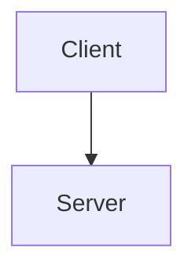

# Documenting Guidelines

> **Version:** 1.0.0
> **Last Updated:** 2025-12-04

## Purpose

Esta guía establece las convenciones para documentar el proyecto BEMYRE. El objetivo es mantener documentación:

- **Modular**: Archivos pequeños y enfocados
- **Navegable**: Fácil de encontrar información específica
- **Mantenible**: Sencilla de actualizar
- **Agent-friendly**: Optimizada para agentes de IA y búsqueda

## Estructura de Directorios

### Principio General

```bash
docs/
├── DOCUMENTING_GUIDELINES.md   # Este archivo
├── ARCHITECTURE.md             # Arquitectura general del proyecto
├── <topic>/                    # Un directorio por tema principal
│   ├── index.md                # Overview y tabla de contenidos
│   ├── quick-reference.md      # Referencia rápida (opcional)
│   └── <subtopic>/             # Subdirectorios por subtema
│       └── <specific>.md       # Archivos específicos
```

### Reglas de Organización

1. **Un tema = Un directorio**
   - Cada tema principal tiene su propio directorio
   - Ejemplo: `server-components/`, `testing/`, `state-management/`

2. **Índice obligatorio**
   - Cada directorio debe tener `index.md`
   - El índice resume el contenido y enlaza a los archivos internos

3. **Archivos pequeños y enfocados**
   - Máximo ~200-300 líneas por archivo
   - Un concepto principal por archivo
   - Si un archivo crece mucho, dividirlo

4. **Referencia rápida opcional**
   - Para temas complejos, incluir `quick-reference.md`
   - Formato: bullet points, tablas, sin explicaciones extensas

## Nombrado de Archivos

### Convenciones

| Tipo        | Formato                   | Ejemplo                 |
| ----------- | ------------------------- | ----------------------- |
| Directorios | `kebab-case`              | `server-components/`    |
| Archivos MD | `kebab-case.md`           | `data-fetching.md`      |
| Guías root  | `SCREAMING_SNAKE_CASE.md` | `CONTRIBUTING.md`       |
| Índices     | `index.md`                | `docs/testing/index.md` |

### Nombres Descriptivos

```bash
# ✅ Buenos
patterns/composition.md
best-practices/common-mistakes.md
architecture/overview.md

# ❌ Evitar
patterns/p1.md
docs/misc.md
notes.md
```

## Formato de Documentos

### Estructura Estándar

```markdown
# Título del Documento

> **Metadata opcional** (fecha, estado, etc.)

## Overview / Introducción
Párrafo breve explicando el propósito del documento.

## Sección Principal 1
Contenido...

### Subsección 1.1
Detalles...

## Sección Principal 2
...

## Related / Ver También
- [Link a documento relacionado](./related.md)
- [Otro recurso](../other/resource.md)

---
**Footer opcional**: Autor, fecha de review, etc.
```

### Elementos Comunes

#### Headers

```markdown
# H1 - Solo uno por documento (título)
## H2 - Secciones principales
### H3 - Subsecciones
#### H4 - Usar con moderación
```

#### Código

````markdown
```tsx
// Especificar lenguaje siempre
export function Example() {
  return <div>Example</div>;
}
```
````

#### Tablas

```markdown
| Header 1 | Header 2 | Header 3 |
| -------- | -------- | -------- |
| Cell 1   | Cell 2   | Cell 3   |
```

#### Callouts

```markdown
> **Note:** Información importante pero no crítica

> **Warning:** Algo que puede causar problemas

> **Tip:** Consejo útil
```

#### Links Internos

```markdown
<!-- Relativos al archivo actual -->
[Ver overview](./overview.md)
[Ir a patrones](../patterns/index.md)

<!-- Desde root del proyecto -->
[Ver CLAUDE.md](/CLAUDE.md)
```

## Contenido

### Qué Documentar

| Incluir                    | No Incluir                     |
| -------------------------- | ------------------------------ |
| Decisiones de arquitectura | Código obvio                   |
| Patrones y convenciones    | Documentación de APIs externas |
| Guías de uso               | TODOs personales               |
| Ejemplos de código         | Notas temporales               |
| Diagramas de flujo         | Changelogs detallados          |

### Principio DRY

- **No duplicar** información entre archivos
- **Enlazar** a la fuente cuando sea necesario
- **Mantener** una única fuente de verdad

### Audiencia

Escribir para:
1. **Desarrolladores nuevos** - Contexto suficiente
2. **Desarrolladores experimentados** - Acceso rápido a detalles
3. **Agentes de IA** - Información estructurada y buscable

## Diagramas

### ASCII Art (Preferido)

```
┌─────────┐     ┌─────────┐
│ Client  │────▶│ Server  │
└─────────┘     └─────────┘
```

### Mermaid (Cuando sea necesario)



## Mantenimiento

### Cuándo Actualizar

- [ ] Al cambiar arquitectura o patrones
- [ ] Al agregar nuevas features
- [ ] Al deprecar funcionalidad
- [ ] Cuando la documentación quede obsoleta

### Review Checklist

- [ ] ¿Los links funcionan?
- [ ] ¿El código es correcto y actual?
- [ ] ¿Está en el directorio correcto?
- [ ] ¿El archivo es < 300 líneas?
- [ ] ¿El título es descriptivo?

## Ejemplo de Estructura

### Para un Tema Nuevo: "Authentication"

```bash
docs/
└── authentication/
    ├── index.md              # Overview de auth en el proyecto
    ├── quick-reference.md    # Cheatsheet de auth
    ├── flows/
    │   ├── login.md          # Flujo de login
    │   ├── logout.md         # Flujo de logout
    │   └── refresh.md        # Refresh de tokens
    ├── implementation/
    │   ├── frontend.md       # Implementación en frontend
    │   └── backend.md        # Integración con backend
    └── security/
        ├── best-practices.md # Mejores prácticas
        └── common-issues.md  # Problemas comunes
```

### index.md de Ejemplo

```markdown
# Authentication

Sistema de autenticación de BEMYRE.

## Quick Links

- [Quick Reference](./quick-reference.md) - Cheatsheet
- [Login Flow](./flows/login.md) - Cómo funciona el login
- [Security Best Practices](./security/best-practices.md)

## Overview

BEMYRE usa JWT con refresh tokens...

## Contents

### Flows
- [Login](./flows/login.md)
- [Logout](./flows/logout.md)
- [Token Refresh](./flows/refresh.md)

### Implementation
- [Frontend](./implementation/frontend.md)
- [Backend Integration](./implementation/backend.md)

### Security
- [Best Practices](./security/best-practices.md)
- [Common Issues](./security/common-issues.md)
```

## Tools & Tips

### Para Agentes de IA

- Usar títulos descriptivos y únicos
- Incluir keywords relevantes en headers
- Estructurar con bullets y tablas
- Evitar párrafos muy largos

### Para Búsqueda

- Usar términos consistentes
- Incluir sinónimos en el contenido
- Añadir tags o metadata cuando sea útil

### Para Mantenibilidad

- Preferir links relativos
- Evitar hardcodear URLs
- Usar path aliases cuando sea posible

---

**Maintainer:** Architecture Team
**Review Cycle:** Quarterly

