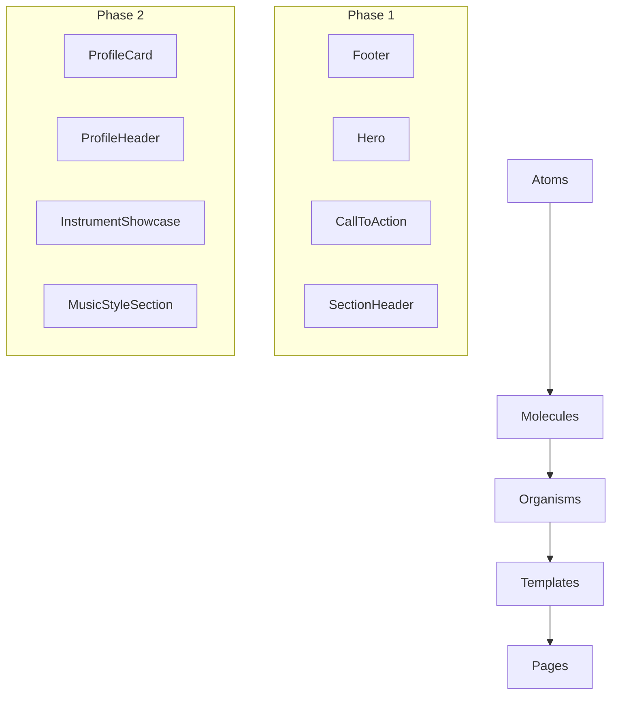

# Legacy Component Migration Plan

> Migration from `bemyre/src/front/js` to `bemyre-v2/client`

## Overview

This document outlines the plan to migrate remaining components from the legacy React application to the new Next.js 16 architecture with Material Design 3 Expressive, i18n support, Storybook documentation, and proper error handling.

## Current State Analysis

### Already Implemented in v2

| Level | Component | Story | Test | i18n |
|-------|-----------|-------|------|------|
| **Atoms** | Button | ✅ | ❌ | - |
| **Atoms** | Avatar | ✅ | ❌ | - |
| **Atoms** | Chip | ✅ | ❌ | - |
| **Atoms** | Logo | ✅ | ❌ | - |
| **Atoms** | ThemeToggle | ✅ | ✅ | - |
| **Atoms** | SearchInput | ✅ | ❌ | ✅ |
| **Atoms** | NavLink | ✅ | ✅ | - |
| **Atoms** | Card | ✅ | ❌ | - |
| **Atoms** | CardMedia | ✅ | ❌ | - |
| **Molecules** | NavbarBrand | ✅ | ❌ | - |
| **Molecules** | NavbarLinks | ✅ | ❌ | - |
| **Molecules** | NavbarActions | ✅ | ❌ | - |
| **Molecules** | CardHeader | ❌ | ❌ | - |
| **Molecules** | CardContent | ❌ | ❌ | - |
| **Molecules** | CardActions | ❌ | ❌ | - |
| **Molecules** | CardChipGroup | ❌ | ❌ | - |
| **Molecules** | GoogleOAuthButton | ✅ | ❌ | ✅ |
| **Organisms** | Navbar | ✅ | ✅ | ✅ |
| **Organisms** | MusicianCard | ✅ | ❌ | ❌ |
| **Organisms** | BandCard | ✅ | ❌ | ❌ |
| **Organisms** | VenueCard | ✅ | ❌ | ❌ |
| **Organisms** | ConcertCard | ✅ | ❌ | ❌ |
| **Organisms** | ErrorBoundary | ✅ | ❌ | ❌ |
| **Organisms** | ConsentBanner | ✅ | ❌ | ❌ |
| **Organisms** | SessionWarningModal | ✅ | ❌ | ❌ |

### Components to Migrate (Prioritized)

---

## Phase 1: Core Layout Components (Priority: HIGH)

Essential components for basic page structure.

### 1.1 Footer (organism)

**Legacy:** `component/Footer.jsx`

**Structure:**
- Logo
- Navigation links (4 columns)
- Social media icons (Instagram, Facebook, Twitter)

**New Implementation:**
```
components/organisms/Footer/
├── Footer.tsx
├── Footer.stories.tsx
├── Footer.test.tsx
└── index.ts
```

**Dependencies:** Logo atom, NavLink atom, Icon atoms

**i18n Keys:**
```json
{
  "footer": {
    "navigation": "Navegación",
    "about": "Acerca de",
    "bandsLocales": "Bandas/Locales",
    "links": {
      "home": "Home",
      "profile": "Perfil",
      "register": "Registro",
      "login": "Inicio sesión",
      "faq": "Preguntas Frecuentes",
      "whatIsBemyre": "¿Qué es Bemyre?",
      "createBand": "¿Cómo creo una banda?",
      "joinBand": "¿Puedo unirme a banda?",
      "values": "Valores y objetivos",
      "popularBands": "Bandas Populares",
      "popularSingers": "Cantantes populares",
      "popularVenues": "Locales populares"
    }
  }
}
```

### 1.2 Hero / LandingJumbo (organism)

**Legacy:** `component/jumbotron/landingjumbo.js`

**Structure:**
- Full-viewport background image
- Headline text
- CTA button ("Únete hoy!")

**New Implementation:**
```
components/organisms/Hero/
├── Hero.tsx
├── Hero.stories.tsx
├── Hero.test.tsx
└── index.ts
```

**Props:**
```typescript
interface HeroProps {
  backgroundImage: string;
  headline: string;
  subheadline?: string;
  ctaText: string;
  ctaHref: string;
  overlay?: 'dark' | 'light' | 'gradient';
  height?: 'full' | 'half' | 'auto';
}
```

### 1.3 CallToAction (molecule)

**Legacy:** `component/CallToAction/CallToAction1.jsx`, `CallToAction2.jsx`

**New Implementation:**
```
components/molecules/CallToAction/
├── CallToAction.tsx
├── CallToAction.stories.tsx
└── index.ts
```

**Variants:** `primary`, `secondary`, `banner`

### 1.4 SectionHeader (molecule)

**Purpose:** Section titles like "Conciertos en tu zona", "Contacta con músicos"

```
components/molecules/SectionHeader/
├── SectionHeader.tsx
├── SectionHeader.stories.tsx
└── index.ts
```

---

## Phase 2: Profile Section Components (Priority: HIGH)

Components for user/band/venue profile pages.

### 2.1 ProfileCard (organism)

**Legacy:** `component/card/CardProfile.jsx`

**Structure:**
- Profile image
- Name
- Followers/Following count
- Bio/Description
- Instruments & Influences
- Follow buttons

**New Implementation:**
```
components/organisms/ProfileCard/
├── ProfileCard.tsx
├── ProfileCard.stories.tsx
├── ProfileCard.test.tsx
└── index.ts
```

**Sub-molecules needed:**
- `FollowStats` - Followers/Following display
- `FollowButton` - Follow/Unfollow with animation

### 2.2 ProfileHeader (organism)

**Legacy:** `component/HeaderProfile.js`

**Structure:**
- Cover image with parallax
- Avatar overlay
- Name with location
- Edit button (if owner)

```
components/organisms/ProfileHeader/
├── ProfileHeader.tsx
├── ProfileHeader.stories.tsx
└── index.ts
```

### 2.3 ProfileSections (molecules)

**Legacy files:**
- `component/profile/MyInstruments.jsx`
- `component/profile/StyleAndMusicalCareer.jsx`
- `component/profile/Influences.jsx`
- `component/profile/Equipment.jsx`
- `component/profile/SpotifyProfile.jsx`

**New implementations:**
```
components/molecules/InstrumentShowcase/
components/molecules/MusicStyleSection/
components/molecules/InfluencesList/
components/molecules/EquipmentGallery/
components/molecules/SpotifyEmbed/
```

### 2.4 BandsSidebar (molecule)

**Legacy:** `component/profile/AsideBands.jsx`

**Purpose:** "Hay 3 bandas que buscan guitarrista" promo card

```
components/molecules/BandRecruitmentCard/
├── BandRecruitmentCard.tsx
├── BandRecruitmentCard.stories.tsx
└── index.ts
```

---

## Phase 3: Explore/Search Components (Priority: MEDIUM)

Components for the explore and search functionality.

### 3.1 ExploreHero (organism)

**Legacy:** `component/jumbotronexplore/ExploreJumbotron.js`

**Structure:**
- Background image
- "¿Dónde nos vamos a rockear?" headline
- Province selector (Spain map)

```
components/organisms/ExploreHero/
├── ExploreHero.tsx
├── ExploreHero.stories.tsx
└── index.ts
```

### 3.2 SpainMap (molecule)

**Legacy:** `component/spain/Spain.js`

**Structure:**
- Interactive SVG map of Spain
- Province hover/select states
- Click handler for province selection

```
components/molecules/SpainMap/
├── SpainMap.tsx
├── SpainMap.stories.tsx
├── provinces.ts  // Province data
└── index.ts
```

**Considerations:**
- Use theme colors for provinces
- Accessible keyboard navigation
- Mobile-friendly touch targets

### 3.3 SearchResultsHeader (molecule)

**Purpose:** "Estos son los resultados para Músicos en Madrid"

```
components/molecules/SearchResultsHeader/
├── SearchResultsHeader.tsx
├── SearchResultsHeader.stories.tsx
└── index.ts
```

### 3.4 EntityGrid (organism)

**Purpose:** Grid layout for cards (Musicians, Bands, Venues, Concerts)

```
components/organisms/EntityGrid/
├── EntityGrid.tsx
├── EntityGrid.stories.tsx
└── index.ts
```

**Features:**
- Responsive grid
- Loading skeletons
- Empty state
- Infinite scroll support

### 3.5 FilterBar (molecule)

**Purpose:** Filters for search results (genres, instruments, location)

```
components/molecules/FilterBar/
├── FilterBar.tsx
├── FilterBar.stories.tsx
└── index.ts
```

---

## Phase 4: Messaging Components (Priority: MEDIUM)

Components for the inbox/chat feature.

### 4.1 MessageBubble (atom)

**Legacy:** `component/inbox/OutgoingMessage.js`, `IncomingMessage.js`

```
components/atoms/MessageBubble/
├── MessageBubble.tsx
├── MessageBubble.stories.tsx
└── index.ts
```

**Props:**
```typescript
interface MessageBubbleProps {
  content: string;
  timestamp: Date;
  direction: 'incoming' | 'outgoing';
  status?: 'sending' | 'sent' | 'delivered' | 'read';
  avatar?: string;
  senderName?: string;
}
```

### 4.2 ChatDateDivider (atom)

**Legacy:** `component/inbox/ChatDate.js`

```
components/atoms/ChatDateDivider/
├── ChatDateDivider.tsx
├── ChatDateDivider.stories.tsx
└── index.ts
```

### 4.3 MessageQuote (molecule)

**Legacy:** `component/inbox/QuoteComp.js`

```
components/molecules/MessageQuote/
├── MessageQuote.tsx
├── MessageQuote.stories.tsx
└── index.ts
```

### 4.4 ChatThread (organism)

**Purpose:** Complete chat conversation view

```
components/organisms/ChatThread/
├── ChatThread.tsx
├── ChatThread.stories.tsx
├── ChatThread.test.tsx
└── index.ts
```

### 4.5 ConversationList (organism)

**Purpose:** List of conversations in inbox

```
components/organisms/ConversationList/
├── ConversationList.tsx
├── ConversationList.stories.tsx
└── index.ts
```

---

## Phase 5: Forms and Settings (Priority: MEDIUM)

### 5.1 SettingsLayout (template)

**Legacy:** Settings page structure from `pages/UserSettings.js`

```
components/templates/SettingsLayout/
├── SettingsLayout.tsx
├── SettingsLayout.stories.tsx
└── index.ts
```

**Structure:**
- Sidebar navigation (accordion style)
- Content area
- Save/Cancel actions

### 5.2 SettingsNav (molecule)

**Legacy:** Settings sidebar with accordion sections

```
components/molecules/SettingsNav/
├── SettingsNav.tsx
├── SettingsNav.stories.tsx
└── index.ts
```

### 5.3 EditableField (molecule)

**Purpose:** Inline editable field with edit button

```
components/molecules/EditableField/
├── EditableField.tsx
├── EditableField.stories.tsx
└── index.ts
```

### 5.4 FormSection (molecule)

**Purpose:** Form section with title and fields

```
components/molecules/FormSection/
├── FormSection.tsx
├── FormSection.stories.tsx
└── index.ts
```

---

## Phase 6: FAQ and Miscellaneous (Priority: LOW)

### 6.1 FAQAccordion (organism)

**Legacy:** `component/faq/AccordionFaq.jsx`, `HeaderFaq.jsx`

```
components/organisms/FAQAccordion/
├── FAQAccordion.tsx
├── FAQAccordion.stories.tsx
└── index.ts
```

### 6.2 Carousel (organism)

**Legacy:** `component/carousel/Carousel.js`

```
components/organisms/Carousel/
├── Carousel.tsx
├── Carousel.stories.tsx
└── index.ts
```

**Consider:** Using existing library like `embla-carousel-react`

### 6.3 AlertDialog (molecule)

**Legacy:** Various alerts in `component/Alerts/`

**Merge with existing ErrorBoundary patterns:**

```
components/molecules/AlertDialog/
├── AlertDialog.tsx
├── AlertDialog.stories.tsx
└── index.ts
```

**Variants:** `info`, `success`, `warning`, `error`, `confirm`

---

## Implementation Guidelines

### For Each Component

1. **Create folder structure:**
   ```
   components/{level}/{ComponentName}/
   ├── {ComponentName}.tsx      # Component implementation
   ├── {ComponentName}.stories.tsx  # Storybook stories
   ├── {ComponentName}.test.tsx     # Tests (molecules+)
   └── index.ts                 # Barrel export
   ```

2. **Use theme tokens:**
   ```typescript
   import { springs, durations, easings, primary, neutral } from "@/app/ui/theme";
   ```

3. **Add i18n support:**
   ```typescript
   import { useTranslations } from "next-intl";
   const t = useTranslations("Components.footer");
   ```

4. **Use logger, not console:**
   ```typescript
   import { useLogger } from "@hooks";
   const log = useLogger("ComponentName");
   ```

5. **Follow accessibility guidelines:**
   - Proper ARIA labels
   - Keyboard navigation
   - Color contrast

6. **Write comprehensive stories:**
   - All variants
   - Interactive states
   - Dark/light mode
   - Responsive sizes

### i18n Message Structure

Add to `messages/{locale}/components.json`:

```json
{
  "footer": { ... },
  "hero": { ... },
  "profile": { ... },
  "explore": { ... },
  "messaging": { ... },
  "settings": { ... },
  "faq": { ... }
}
```

---

## Timeline Estimate

| Phase | Components | Complexity |
|-------|------------|------------|
| Phase 1 | 4 components | Medium |
| Phase 2 | 8 components | High |
| Phase 3 | 5 components | High |
| Phase 4 | 5 components | Medium |
| Phase 5 | 4 components | Medium |
| Phase 6 | 3 components | Low |

**Total:** 29 new components

---

## Dependencies

### External Libraries to Consider

- `embla-carousel-react` - For Carousel
- `react-spring` or continue with `framer-motion` - Animations
- `@tanstack/react-virtual` - Virtual scrolling for long lists

### Internal Dependencies



---

## Testing Strategy

| Level | Coverage Target | Test Types |
|-------|-----------------|------------|
| Atoms | Stories only | Visual regression |
| Molecules | 70% | Unit + Integration |
| Organisms | 80% | Unit + Integration + A11y |
| Templates | 70% | Integration + E2E |

---

## Migration Checklist Per Component

- [ ] Create component file with TypeScript
- [ ] Use theme tokens (no hardcoded values)
- [ ] Add forwardRef if needed
- [ ] Create Storybook stories
- [ ] Add i18n keys and translations
- [ ] Write tests (if molecule+)
- [ ] Update barrel exports in `index.ts`
- [ ] Document in component JSDoc
- [ ] Test in dark/light mode
- [ ] Test responsive behavior
- [ ] Accessibility audit
